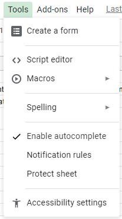
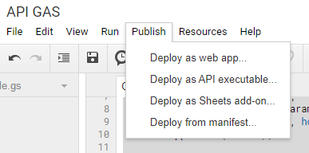
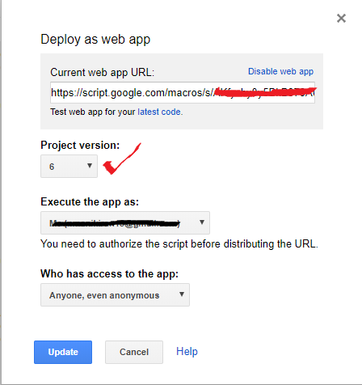

## Google Spreadsheet API Apps Script and JavaScript

this repo is just ineract with the google sheet with javascript and get data as JSON through `AppScript`

## Setup
we need Spreadsheet id to get that
- Create a google sheet and run the flowing code on console to ge the sheet id (open browser inspect by hitting Ctrl+Shift+I)

    `var matches = /\/([\w-_]{15,})\/(.*?gid=(\d+))?/.exec(window.location.href);

    if (matches) {
    console.log("Spreadsheet Id: " + matches[1]);
    }`

- Under `tools` you will find the `Script Editor` click on it and use the code inside `Code.gs` file

- After making each change we need to publish the code as `Deploy as web app`

For each change update the version number otherwise changes wont reflect 

- Copy the web app URL

